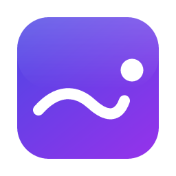

<p align="center">
  
</p>

<h1 align="center">Mote</h1>

<p align="center"><strong>AI that stays in the flow.</strong></p>

<p align="center">
  A local-first writing and prompting layer for macOS and Windows.<br>
  It completes your sentences, fixes your spelling and sharpens your AI prompts,<br>
  in whatever app you're typing in, without copy-pasting into a chat window.
</p>

---

Mote lives in the menu bar (macOS) or system tray (Windows). It watches the text field you are typing in, and when it can help, it shows a small suggestion next to your caret. Press **Tab** to accept or **Esc** to dismiss, or just keep typing. Everything else happens in a command palette you open with one shortcut.

## What it does

| | |
|---|---|
| **Inline completion** | Ghost-text continuations as you type, in chat apps, email, AI prompts and notes. **Tab** accepts; **⌥]** / **⌥[** (Alt on Windows) cycles through alternatives. |
| **Spelling, locally** | Misspelled words are caught on your machine with a 82,000-word frequency dictionary. Tab accepts the fix. No tokens, no network. |
| **Grammar that keeps your voice** | When a finished sentence looks risky, one sentence is checked by AI and the minimal correction is offered. |
| **Prompt enhancer** | Typing to ChatGPT, Claude, Gemini, Copilot or Claude Code? Pause, and press **Tab** on "Enhance prompt" to rewrite your prompt in place (undo brings yours back). The palette offers every style: improve, make precise, make technical, structure, debug, research, explain, expand context, or your own instruction. |
| **Command palette** | **⌘⇧Space** / **Ctrl+Shift+Space** on any selection or text field: fix, rewrite, change tone, shorten, summarize, explain, translate, continue writing, create a prompt. |
| **Context-aware** | Copy an error, a stack trace, code or an issue link, then switch apps, and Mote suggests the obvious next step ("Debug this error", "Create coding task", …). |
| **Hinglish and Marathi, as written** | Mixed English-Hindi, romanized Hindi and Marathi, and Devanagari are detected and preserved. Mote never translates your text unless you ask. |
| **Usage you can see** | Tokens, requests, latency and estimated cost per feature and model, with Groq's rate limits, all computed locally. Raw prompts are never stored. |

## Privacy at a glance

- **Text is read only from the field you're typing in**, only around the caret, and only when Mote is enabled, not paused, and the app or window isn't excluded.
- **Never observed:** password managers, password fields in every app, anything while macOS Secure Input is on, and Mote's own windows. Add your own exclusions by app or window title (for example "bank").
- **Sent to Groq** (the AI provider you configure) only for the feature in use: the end of your draft (up to 600 characters) for completion, one sentence for grammar, the prompt you enhance, or the selection for palette actions, plus the app name and detected language. One switch turns all cloud AI off.
- **Update checks** download Mote's release manifest from GitHub and send nothing about you. You can turn them off.
- **Stored locally:** settings, usage metadata (token counts, latency, model, feature: no text) and short-lived activity metadata (app names, no titles or text), in a SQLite file only your user account can read. Your API key is kept in the macOS Keychain or Windows Credential Manager.
- **Never stored or logged:** typed text, prompts, model outputs, clipboard contents, window titles or API keys.

Full details: [docs/privacy/privacy-model.md](docs/privacy/privacy-model.md).

## Install

Download the latest release from the [Releases page](https://github.com/Prathameshppawar/mote/releases/latest).

| Platform | File |
|---|---|
| macOS, Apple Silicon (M1 and later) | `Mote_<version>_aarch64.dmg` |
| macOS, Intel | `Mote_<version>_x64.dmg` |
| Windows 10/11 (x64) | `Mote_<version>_x64-setup.exe` (recommended, installs for your account) or `Mote_<version>_x64_en-US.msi` (installs for all users, needs administrator rights) |

Each release includes `SHA256SUMS.txt`. To verify a download:

```sh
shasum -a 256 -c SHA256SUMS.txt --ignore-missing          # macOS
Get-FileHash .\Mote_<version>_x64-setup.exe -Algorithm SHA256  # Windows PowerShell
```

### macOS

1. Open the `.dmg` and drag **Mote** to **Applications**.
2. Open Mote. Release builds are not yet notarized by Apple, so macOS blocks the first launch. Go to **System Settings → Privacy & Security**, scroll down and click **Open Anyway**. (Or run `xattr -dr com.apple.quarantine /Applications/Mote.app` once.)
3. Follow onboarding. When asked, enable Mote under **System Settings → Privacy & Security → Accessibility**. This is what lets Mote read the text field you're typing in and insert accepted suggestions.

> From 1.1 on, Mote updates itself and keeps its permissions across updates. Moving from 1.0 takes two one-time steps: choose **Always Allow** when macOS asks for your login password so Mote can read its saved key, and if suggestions don't appear, remove Mote from the Accessibility list and add it again.

### Windows

1. Run `Mote_<version>_x64-setup.exe`. Windows SmartScreen may say "Windows protected your PC" because the installer isn't code-signed yet: click **More info → Run anyway**.
2. The installer adds Mote for your user account (no administrator rights needed) and installs the Microsoft Edge WebView2 runtime if it's missing. (The MSI installs for all users instead and asks for administrator rights; install only one of the two.)
3. Mote starts in the system tray. Onboarding walks you through the rest.

### Set up AI

Mote uses [Groq](https://groq.com) for its AI features. Create a key at [console.groq.com/keys](https://console.groq.com/keys) (a free tier is available) and paste it during onboarding or under **Settings → AI Providers**. Spelling, language detection, context detection and the usage dashboard work without a key.

## Using Mote

| Shortcut | Action |
|---|---|
| **⌘⇧Space** / **Ctrl+Shift+Space** | Open the command palette (configurable) |
| **Tab** | Accept the visible suggestion, or enhance the prompt when "Enhance prompt" is showing |
| **Esc** | Dismiss it |
| **⌥]** / **⌥[** (Alt+] / Alt+[ on Windows) | Next / previous alternative |

Tab, Esc and the alternative keys are captured only while a suggestion is on screen; otherwise they reach your app as usual.

From the tray menu you can pause Mote for an hour, switch assistance, completion or context awareness on and off, open the command palette, jump to Usage, Privacy, Diagnostics or Settings, and **Restart to Update** when a new version has been downloaded.

On a Mac with a notch, a crowded menu bar can hide Mote's icon. Opening Mote again from Applications or Spotlight brings up Settings, and ⌘-dragging the icon towards the clock keeps it visible.

## Supported platforms

| | Minimum | Builds | Status in 1.0 |
|---|---|---|---|
| macOS | 11 Big Sur | Apple Silicon, Intel | Supported; developed and tested on macOS 26 (Apple Silicon) |
| Windows | 10 or 11 | x64 | Supported; built and unit-tested in CI, see [known limitations](docs/releases/v1.0.0.md#known-limitations) |

Mote reads text through the operating system's accessibility APIs (Accessibility on macOS, UI Automation on Windows), so it can assist wherever an app exposes its text fields to them. That includes native apps, Chrome-based browsers and Electron apps such as VS Code, Slack and Notion (Mote switches on the accessibility tree they keep off by default). Apps that draw their own text without exposing it (some games, terminals, remote desktop clients) can't be assisted, and the new Microsoft Teams and Outlook desktop apps expose their text unreliably.

## Build from source

Prerequisites:

- [Rust](https://rustup.rs) via rustup. The toolchain (1.99) is pinned in `rust-toolchain.toml` and installed automatically.
- [Node.js](https://nodejs.org) 20.19 or newer (22 LTS recommended).
- macOS: Xcode Command Line Tools (`xcode-select --install`).
- Windows: Visual Studio Build Tools with "Desktop development with C++", and WebView2 (included in Windows 11).

```sh
git clone https://github.com/Prathameshppawar/mote.git
cd mote/apps/desktop
npm ci
npm run tauri dev      # run with hot reload
npm run tauri build    # build installers into target/release/bundle
```

Tests and checks:

```sh
cargo test --workspace                                   # Rust (from the repository root)
cargo clippy --workspace --all-targets -- -D warnings
cd apps/desktop && npm run typecheck && npm run lint && npm test
```

See [docs/development/setup.md](docs/development/setup.md) and [docs/development/testing.md](docs/development/testing.md) for details, including running against the real Groq API.

## Project layout

```text
crates/
  mote-core/        engine, observer, privacy policy, language, spelling, intent,
                    context, prompts, provider abstraction, usage accounting (pure Rust)
  mote-providers/   Groq / OpenAI-compatible HTTP provider
  mote-storage/     SQLite storage and migrations
  mote-platform/    macOS (Accessibility) and Windows (UI Automation) adapters
apps/desktop/
  src-tauri/        Tauri app: tray, windows, shortcuts, IPC commands, keychain
  src/              React UI: settings, onboarding, usage dashboard, palette, overlay
docs/               architecture, privacy, development, product, decisions, releases
```

## Documentation

- Architecture: [overview](docs/architecture/overview.md) · [context engine](docs/architecture/context-engine.md) · [providers](docs/architecture/provider-system.md) · [usage](docs/architecture/usage-system.md) · [platform layer](docs/architecture/platform-layer.md)
- [Privacy model](docs/privacy/privacy-model.md) · [Security policy](SECURITY.md)
- Development: [setup](docs/development/setup.md) · [testing](docs/development/testing.md) · [releasing](docs/development/releasing.md) · [contributing](CONTRIBUTING.md)
- Product: [vision](docs/product/vision.md) · [v1 scope](docs/product/v1-scope.md) · [roadmap](docs/product/roadmap.md)
- [Architecture decision records](docs/decisions/) · [Changelog](CHANGELOG.md)

## License

[MIT](LICENSE) © 2026 Prathamesh Pawar. Third-party components are listed in [THIRD_PARTY_NOTICES.md](THIRD_PARTY_NOTICES.md).
