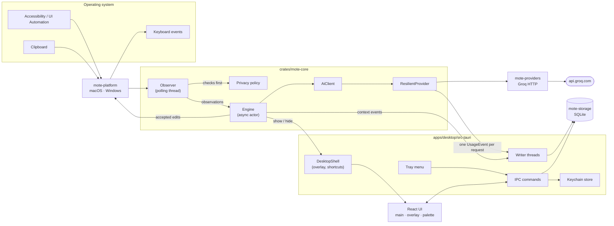

# Architecture overview

Mote is a Tauri 2 desktop app with a Rust core and a React interface. The core makes every decision (when to suggest, what to send, what to record) and is pure, trait-based Rust that runs and is tested without an operating system, a network or a UI. Everything platform-specific sits behind a small number of traits.



## Crates

| Crate | Responsibility | Depends on |
|---|---|---|
| `mote-core` | Engine, observer, privacy policy, language detection, spelling, intent classification, context events and insights, prompts, provider abstraction and resilience, usage accounting, pricing and dashboard aggregation, settings and validation | No I/O beyond traits; `tokio` for the actor |
| `mote-providers` | `OpenAiCompatibleProvider` and `GroqProvider`: HTTP, request dialects, reasoning controls, rate-limit headers, error mapping, `ApiKey` | `mote-core`, `reqwest` |
| `mote-storage` | SQLite schema and migrations, settings, usage aggregation (local-time buckets), pricing, exclusions, context metadata, retention, reset | `mote-core`, `rusqlite` (bundled) |
| `mote-platform` | `PlatformAdapter` for macOS (AXUIElement, NSWorkspace, NSPasteboard, Quartz events) and Windows (UI Automation, Win32, clipboard, `SendInput`); an "unsupported" adapter elsewhere | `mote-core`, `objc2` / `windows` |
| `mote-desktop` (`apps/desktop/src-tauri`) | Composition root: app state, windows, tray, global shortcuts, IPC commands, overlay shell, palette, diagnostics, keychain, logging | all of the above, Tauri 2 |
| UI (`apps/desktop/src`) | Settings and onboarding (`index.html`), suggestion overlay (`overlay.html`), command palette (`palette.html`) | React 19, generated TypeScript bindings |

The dependency direction is strictly inward: nothing depends on `mote-desktop`, and `mote-core` depends on no other Mote crate. TypeScript types for every IPC payload are generated from the Rust types with `ts-rs` (`cargo test -p mote-desktop --features bindings export_bindings`), so the UI and the core cannot drift apart silently; CI fails when the generated files are stale.

## Core traits

| Trait | Implemented by | Purpose |
|---|---|---|
| `PlatformAdapter` | `MacPlatform`, `WindowsPlatform`, `UnsupportedPlatform`, `FakePlatform` (tests) | Active app, focused input (bounded reads), selection, clipboard, typing, keys, paste, select-all, permissions |
| `ModelProvider` | `OpenAiCompatibleProvider` / `GroqProvider`, `ScriptedProvider` (tests) | `generate`, `list_models`, `health_check`, `usage_snapshot` |
| `UsageSink` | `UsageWriter` (SQLite, background thread), `MemoryUsageSink`, `NullUsageSink` | Receives exactly one `UsageEvent` per logical request |
| `AssistantShell` | `DesktopShell`, `FakeShell` (tests) | Shows and hides the overlay, toggles suggestion keys, publishes engine status |

Because every outside dependency is a trait, the engine's behaviour (debouncing, cancellation, stale-result handling, Tab acceptance, retries, metering) is covered by deterministic tests that use virtual time, a scripted provider and a fake platform.

## Runtime

When Mote starts (`apps/desktop/src-tauri/src/lib.rs`):

1. Logging is initialised (daily files, 7 kept, metadata only).
2. The SQLite database is opened and migrated; settings, exclusions and pricing are loaded.
3. The API key is read from the keychain into the `GroqProvider`; the provider is wrapped in a `ResilientProvider` whose usage sink is the `UsageWriter` thread.
4. The engine actor is spawned on the async runtime, and the observer thread starts polling the platform adapter.
5. The overlay window is created hidden; the tray, global shortcut, maintenance task (hourly retention pruning) and a delayed provider health check are set up.
6. The main window opens only for onboarding or when you open Settings; otherwise Mote lives in the menu bar or tray (`LSUIElement` on macOS).

| Thread or task | What it does | Why separate |
|---|---|---|
| Observer thread | Polls focus, text and clipboard every 100 ms to 1 s; evaluates privacy before reading | Accessibility calls block; they must never stall the UI or the engine |
| Engine task | Owns the context window and all suggestion state; serialises every decision | One owner means no locks around assistance state |
| Model request tasks | One per request, cancellable with a `CancellationToken` | Typing never waits for the network |
| `UsageWriter` thread | Persists usage events, notifies the UI | Model calls never wait on the database |
| Context writer thread | Persists metadata events when retention allows | Same |
| Maintenance task | Prunes context and usage history hourly | Retention without user action |
| Update task | Checks GitHub Releases a minute after launch and every six hours, downloads and verifies updates | Updates without blocking anything ([ADR 0008](../decisions/0008-updates-and-signing.md)) |

## Windows and IPC

| Window | Page | Focusable | Allowed commands (Tauri capability) |
|---|---|---|---|
| `main` | `index.html` | yes | settings, providers, models, pricing, usage, privacy, exclusions, diagnostics, onboarding (`capabilities/main.json`) |
| `overlay` | `overlay.html` | **no**, and click-through | listen for `overlay-view` / `overlay-hide`, `overlay_ready` |
| `palette` | `palette.html` | yes | `palette_*`, `get_engine_status` |

The overlay never takes focus, so the app you are typing in keeps its caret, selection and IME state. The palette captures your context (app, field, selection, intent, recent clipboard) *before* it takes focus, then re-activates your app to apply the result.

The permission set for each window is generated from the command list in `build.rs` and checked by Tauri on every call. The content security policy allows only the app's own scripts and the IPC endpoint.

Events from Rust to the UI: `overlay-view`, `overlay-hide`, `engine-status`, `usage-updated`, `settings-changed`, `provider-changed`, `update-status`, `navigate`, `palette-open`.

## Life of a completion

```mermaid
sequenceDiagram
    participant App as Your app
    participant Obs as Observer
    participant Eng as Engine
    participant AI as AiClient + ResilientProvider
    participant Groq
    participant Ovl as Overlay

    App->>Obs: focused field changes (polled)
    Obs->>Obs: privacy policy: app, title, secure field, pause
    Obs->>Eng: Observation (bounded text around caret)
    Eng->>Eng: classify intent, detect language
    Eng->>Eng: debounce 450 ms; should_complete? cache hit?
    Eng->>AI: complete() in a spawned task
    AI->>Groq: chat completion (last 600 chars)
    Groq-->>AI: continuation + usage
    AI-->>Eng: CompletionReady (UsageEvent recorded once)
    Eng->>Eng: discard if the text changed meanwhile
    Eng->>Ovl: show ghost text at the caret
    App->>Eng: Tab (registered only while visible)
    Eng->>App: type the continuation
```

If you keep typing while a request is in flight, the request is cancelled. If its result arrives for text that no longer matches, it is dropped. If you type the beginning of the suggestion, the overlay shrinks to the remaining part instead of re-requesting.

## Invariants

These are enforced in code and covered by tests:

1. **Privacy before reading.** The observer evaluates the policy (enabled, paused, permission, Secure Input, password managers, Mote itself, exclusions, secure fields) before any text or clipboard read. See [privacy model](../privacy/privacy-model.md).
2. **Typing is never blocked.** Model calls, database writes and accessibility reads happen off the engine's critical path; stale results are discarded.
3. **One usage event per logical request**, whatever the number of HTTP attempts or fallbacks. Requests that never leave the machine record nothing. See [usage system](usage-system.md).
4. **No content at rest.** Only metadata is persisted; content lives in memory for a bounded time.
5. **Never insert into stale text.** On Tab, the focused field is read again, and the edit is applied only if the text before the caret still ends with what the suggestion was made for. Otherwise the Tab key is passed through to the app as if Mote weren't there.
6. **Language is preserved.** Every prompt carries an instruction to keep the user's language and script; only an explicit Translate action changes it.

## Error handling

- Provider errors are typed (`ProviderError`: not configured, cloud disabled, unauthorized, model unavailable, rate limited, timeout, network, server, bad request, invalid response, cancelled) and mapped to short, actionable messages. Raw provider messages are truncated and secret-redacted.
- Automatic features fail quietly: a status in the tray and Diagnostics, not a dialog while you type. User-initiated actions (palette) show the error where you started them.
- Platform errors distinguish "not supported here" (fall back, for example from paste to typing) from "failed" and "permission denied".
- IPC commands return `CommandError { code, message }`. The UI shows the message and never a stack trace.

## Further reading

- [Context engine](context-engine.md): observer, events, intent, language, insights and suggestion lifecycle
- [Provider system](provider-system.md): providers, routing, resilience
- [Usage system](usage-system.md): metering, aggregation, pricing, dashboard
- [Platform layer](platform-layer.md): macOS and Windows adapters
- [Decision records](../decisions/)
